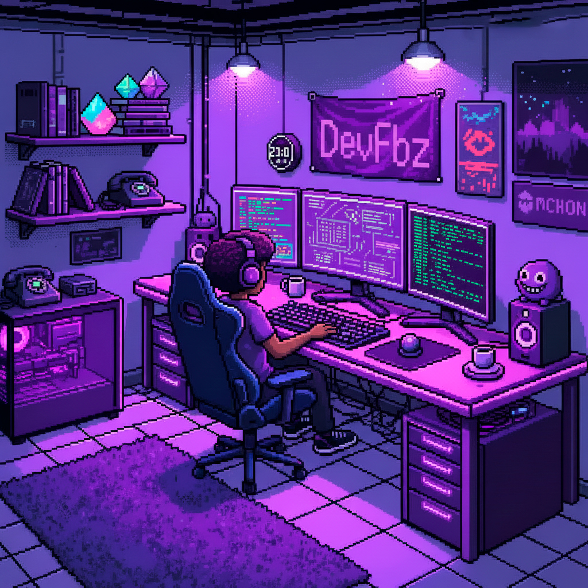

 
 
 

  

  
  <b>`プ ロ グ ラ マ`</b>
  <samp>
       
      Hi there! I'm <b>Breno Fabrizio</b>
  </samp>

  

 

  

      
 
 
      

  
  
   
   
  

 
 
  <!-- 
  
  
  
  
  
  
  
  
  
  
  
   -->
  

 
 

  
  

      <samp>
        <b>More Info</b>
      </samp>
  

  
 

##

 

  <samp>
    <b>
      Contact me:
    </b>
  </samp>
   
   

  
  
  
  

  

 

##

 

  

 

 <picture align="center">
  <source media="(prefers-color-scheme: dark)" srcset="https://raw.githubusercontent.com/DevFbz/DevFbz/output/github-contribution-grid-snake-dark.svg">
  <source media="(prefers-color-scheme: light)" srcset="https://raw.githubusercontent.com/DevFbz/DevFbz/output/github-contribution-grid-snake-dark.svg">
  
</picture>
 

 
 
 
